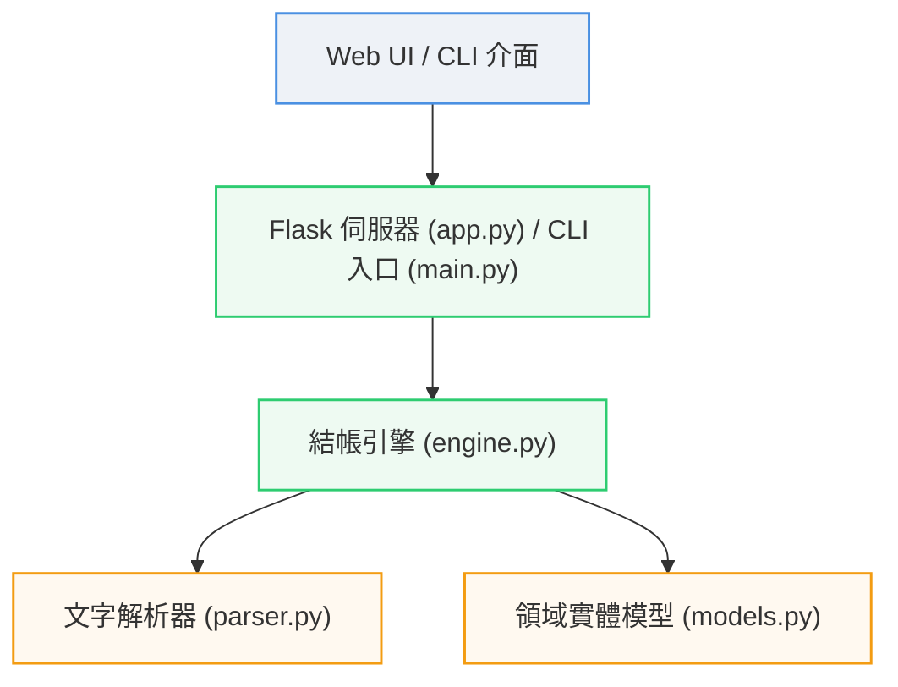

# WisdomGarden 智慧結帳與購物車系統

本專案是一個購物車系統。支援促銷折扣與優惠券計算，提供 **命令列 CLI 介面** 與 **Web 控制面板 UI**。

---

## 系統架構

### 1. 模組關聯圖 (Mermaid)



### 2. 專案目錄結構

```text
wisdom_garden_inter/
├── shopping_cart/          # 結帳核心模組
│   ├── models.py           # 領域實體 (Cart, Product, Promotion, Coupon...)
│   ├── parser.py           # 強健文字輸入解析器
│   └── engine.py           # 結帳計算引擎
├── tests/                  # 測試用例與資料 (case_a.txt, case_b.txt)
├── static/ & templates/    # 前端 Web 控制面板
├── main.py                 # 命令列 CLI 進入點
└── app.py                  # Flask Web API 服務器
```

---

## ⚙️ 核心業務邏輯

1. **強健解析 (Parser)**:
   - 藉由每行特徵（`|` 判定促銷、`*` 與 `:` 判定商品、3 個空格分隔元素判定優惠券、單一日期判定結算日）自動對齊解析。
   - 移除 `//` 註解
2. **高精度金額運算 (Precision)**:
   - 採用 **`decimal.Decimal`** 進行小數累計與乘積。
   - 最終輸出時，套用 `ROUND_HALF_UP` 四捨五入，保留至小數點後兩位。
3. **優惠尋優計算 (Strategy Pattern)**:
   - **品類促銷折扣 (`Promotion`)**：比對結算日與品類，若當天該品類有多個折扣活動，系統自動採用最優解（折扣率最低者）。
   - **滿額優惠券 (`Coupon`)**：先套用完品類促銷折抵後，再判定是否達到優惠券門檻且未過期，滿足則進行金額扣減。
   - **結算順序**：商品原價小計 $\rightarrow$ 套用品類促銷 $\rightarrow$ 套用滿額優惠券 $\rightarrow$ 四捨五入輸出。

---

## 使用方式

### 1. 安裝與環境準備
本專案僅依賴 `Flask`（用於 Web 介面），其餘核心引擎皆為 Python 標準庫。
```bash
pip install flask
```

### 2. 執行單元測試
```bash
python -m unittest discover -s tests
```

### 3. 命令列 CLI 結帳
支援讀取文字檔或由標準輸入 (stdin) 接收結帳資訊：
```bash
# 讀取 Case A 範例檔
python main.py tests/case_a.txt

# 讀取 Case B 範例檔
python main.py tests/case_b.txt

# 互動式或管道輸入
cat tests/case_a.txt | python main.py
```

### 4. 啟動 Web 控制面板
1. 啟動 Flask 服務：
   ```bash
   python app.py
   ```
2. 開啟瀏覽器訪問 `http://127.0.0.1:5000`。
3. 可透過網頁介面載入 Case 範本、自定義輸入，並查看流暢的視覺化結帳收據與明細拆解。
